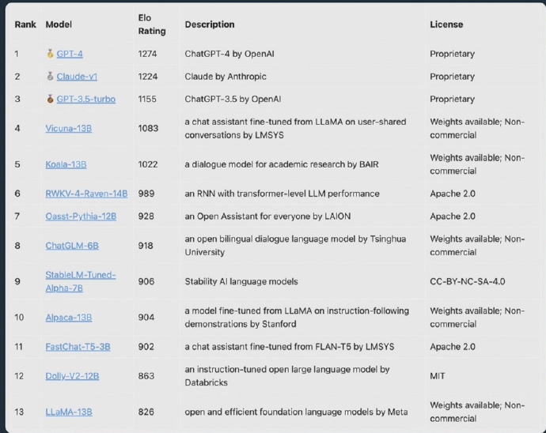

# 网络信息

## 人工智能

1. LLM 排名

当前的LLM排名，其中第6和第8是国内做的。第6更神奇，作者是一个物理博士，开了一家卖灯泡的公司（在广东），然后做LLM完全是业余爱好。并且，它的架构是RNN，可以支持无限的上下文长度，现在业界都在讨论它，前两天把论文公开了。

这里评分用的是Elo评分，这个评分是用在国际象棋里面的，基本的作法是打擂台。就是给定一些任务，两个LLM分别给出答案，然后由GPT-4来打分，看哪个赢。不断对决后产生这个Elo排名。

关于Elo，可以看这个链接：www.biaodianfu.com/elo-glicko-trueskill.html

来源：https://weibo.com/1912085257/N2bnBoFNK

相关报道：https://www.51cto.com/article/754844.html