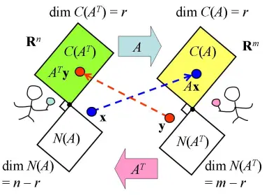

# 转置矩阵

《机器学习数学基础》第 2 章 2.3.2 节介绍了转置矩阵的基本概念，并且在之后的有关问题探讨中，经常会用到转置矩阵。为了能深入理解转置矩阵，转载参考资料 [1] 中以线性变换角度理解转置矩阵的意义的有关内容，供读者参考。

矩阵 $\pmb{A}$ 为 $m\times n$ ，从线性变换的角度来看：$\begin{split}\pmb{A}&:\mathbb{R}^n\to\mathbb{R}^m\\\pmb{A}^{\text{T}}&:\mathbb{R}^m\to\mathbb{R}^n\end{split}$

如下图所示：

在“[秩—零化度定理](https://lqlab.readthedocs.io/en/latest/math4ML/linearalgebra/basetheory.html)”中，对 $\pmb{A}$ 和 $\pmb{A}^{\rm{T}}$ 的列空间维数关系进行了阐述，请参考。

## 1. 转置矩阵的定义

结合上图，设 $\pmb{x},\pmb{A}^{\rm{T}}\pmb{y}\in\mathbb{R}^n；\pmb{y},\pmb{Ax}\in\mathbb{R}^m$​ 。因为：

$$
(\pmb{Ax})^{\rm{T}}\pmb{y}=\pmb{x}^{\rm{T}}\pmb{A}^{\rm{T}}\pmb{y}=\pmb{x}^{\rm{T}}(\pmb{A}^{\rm{T}}\pmb{y})
$$

可得：$\mathbb{R}^m$ 中的向量 $\pmb{Ax}$ 与 $\pmb{y}$ 的点积等于 $\mathbb{R}^n$ 中的向量 $\pmb{x}$ 与 $\pmb{A}^{\rm{T}}\pmb{y}$ 的点积 $^{[2]}$ 。

以上的性质，称为**伴随**（adjoint），利用这个性质定义转置矩阵：

设 $m\times n$ 的实矩阵 $\pmb{A}$ ，则转置矩阵 $\pmb{A}^{\text{T}}$ 应满足：$(\pmb{Ax})^{\rm{T}}\pmb{y}=\pmb{x}^{\rm{T}}(\pmb{A}^{\rm{T}}\pmb{y})$ 。

## 参考文献

[1]. [线代启示录：转置矩阵的意义](https://ccjou.wordpress.com/2010/05/20/%e8%bd%89%e7%bd%ae%e7%9f%a9%e9%99%a3%e7%9a%84%e6%84%8f%e7%be%a9/)

[2]. 关于内积和点积的详细内容，请参阅[《机器学习数学基础》](https://lqlab.readthedocs.io/en/latest/math4ML/index.html)第1章1.4.2节。​
